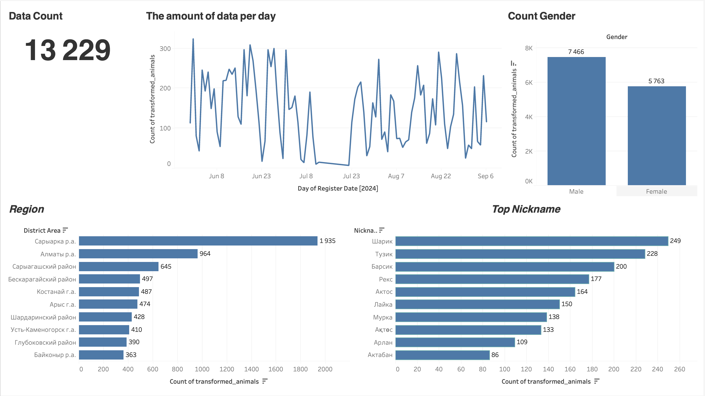

# Animals Kezekte


This project is a full-fledged analogue of the ETL process. Open data from the platform is used as data sources **tanba.kezekte.kz**. The main tool for performing ETL is **Python**. The processes are orchestrated using **Apache Airflow**. All data is stored in the **PostgreSQL** database, and **Tableau** is used for visualization.

## Getting Started

#### Installing and activating a virtual environment
Before starting a project, it is recommended to create and activate a virtual environment (venv) to isolate the project's dependencies:

##### **Creating a virtual environment**:
```
python3 -m venv venv
```

##### Activating the virtual environment:
- On Windows:
    ```
    .\venv\Scripts\activate
    ```
- On macOS/Linux:
    ```
    source venv/bin/activate
    ```
After activating the virtual environment, all dependencies will be installed into it.
#### Building the Docker Images
To build the Docker images, navigate to the root directory of the project in your terminal and run the following command in background:

```
docker-compose up -d
```
To show all the running docker containers
```
docker ps
```
To stop all the docker containers
```
docker-compose down
```
To go inside the docker container
```
docker exec -it <containerID> bash
```
-----

## Prerequisites
- Docker: Make sure you have Docker installed on your system. You can download it from [here](https://www.docker.com/products/docker-desktop).
- Docker Compose: Also ensure that Docker Compose is installed. You can find it [here](https://docs.docker.com/compose/install/).

## Services

| Service     | Port                    | User        | Password
| ----------- | -----------             | ----------- | -----------
| Airflow     | http://localhost:8080   | airflow     | airflow
| PostgreSQL  | Dbeaver host:localhost  | airflow     | airflow
| Tableau     | Tableau host:localhost  | airflow     | airflow

## Source
Open data from the platform is used as data sources [**tanba.kezekte.kz**](https://tanba.kezekte.kz/ru/frameless/animal/list?p=1).

